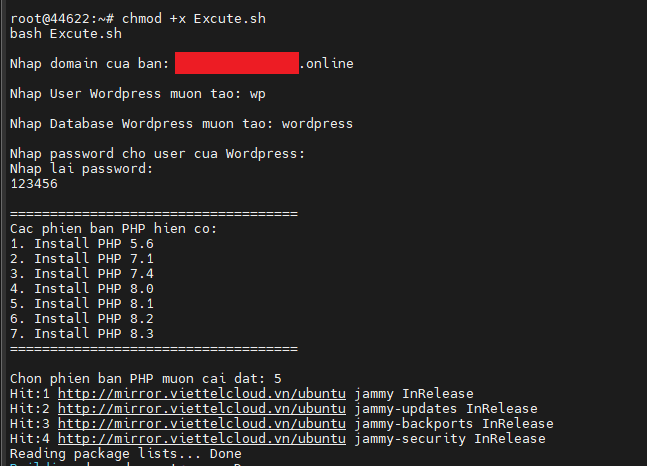

# Ubuntu-22.04_LEMP-and-Wordpress-Automatic-Installation-Script

## 1. Tải xuống bash file

```
wget https://raw.githubusercontent.com/eovipmak/Ubuntu-22.04_LEMP-and-Wordpress-Automatic-Installation-Script/main/Excute.sh
```
## 2. Chạy file

```
chmod +x Excute.sh
bash Excute.sh
```
Quý khách nhập thông tin theo hướng dẫn trên màn hình, nếu xuất hiện bảng vui lòng nhấn Enter.



*Chúc Quý khách cấu hình thành công*
